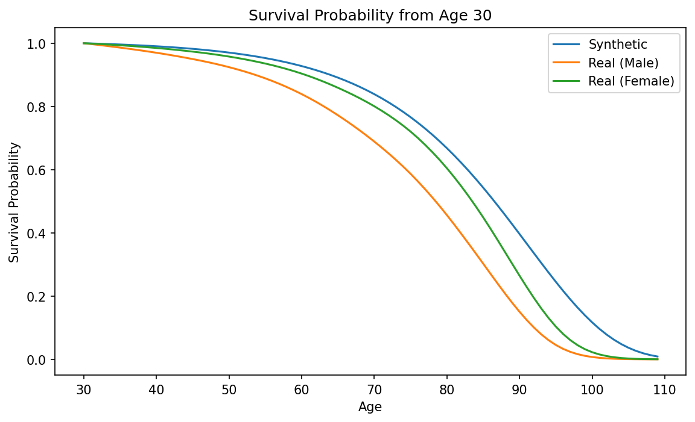
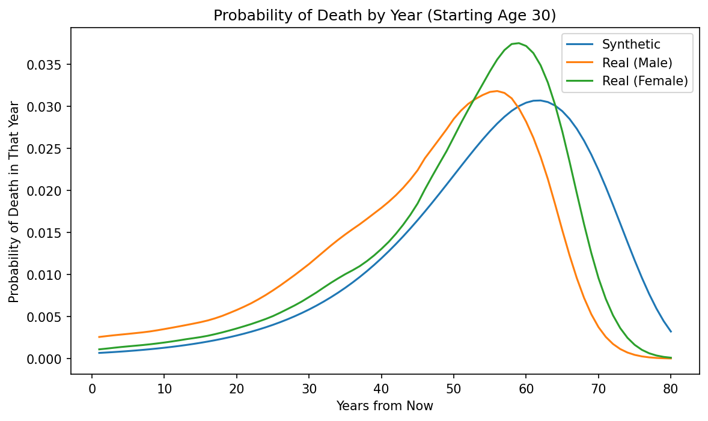
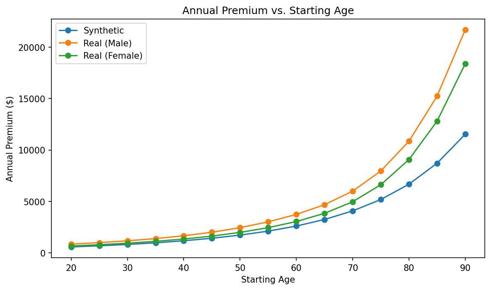

# Life Table Survival Analysis & Insurance Premium Pricing

## Introduction

This Python project calcualtes survival probabilities from mortality tables as well as prices life insurance as both lump sum and the annual equivalent premium. The tables used are a synthetic mortaility table (finding qx using the Gompertz-Makeham formula) and real U.S. SSA data split between both male and female mortality rates.

## Overview

The project includes the ability to calculate death probabilties year-by-year using mortality tables as well as the number of years more a person of a given age should be able to live up until using a sum of survival proabbilties. It also helps to calcualte the fair price of a life insurance policy today by finding the discounted future payout calculated as both lump sum and annual premium. It also helps to compare how the use of differnt types of mortaility tbales differs results, where I used both the mathematical approximation of Gompertz-Makeham as well as real U.S. Social Security Administration mortality data of both male and female.

## Explanation of Components of Project

### Obtaining the Mortality Data (Mortality Tables)

A mortality table lists all the qx (probability of dying) for each age, given oyu are alive by the start of it and this project uses two types of it:

- A synthetic table formulated by the Gompertz-Makeham formula, which is a simple mathematical approximation of qx which was used to test the code first
- Real U.S. SSA data composing of both male and female qx values form the 2021 Period Life Table

### Survival Probability

```python
def survival_probability(mortality_table, start_age, years):
    survival = 1.0
    for age in range(start_age, start_age + years):
        qx = mortality_table.loc[mortality_table['age'] == age, 'qx'].values[0]
        px = 1 - qx   # probability of SURVIVING that year
        survival *= px
    return survival
```
The yearly survival probabilties consists of taking the qx and taking it from 1 to find the survival probability of that year and compounding the survival probabilties of the years up until the final year.

### Life Expectancy

```python
from survival_probability import survival_probability

def life_expectancy(mortality_table, start_age, max_age=110):
    expectancy = 0
    for years in range(1, max_age - start_age + 1):
        expectancy += survival_probability(mortality_table, start_age, years)
    return expectancy
```
This function takes the survival probabilties of the years up until the max age from your start age and takes the sum of them, which in turn returns the life expectancy.

### Probability of Death in a Specific Year

```python
from survival_probability import survival_probability

def probability_of_death_in_year(mortality_table, start_age, year):
    survive_to_year_start = survival_probability(mortality_table, start_age, year - 1)
    qx_that_year = mortality_table.loc[mortality_table['age'] == start_age + year - 1, 'qx'].values[0]
    return survive_to_year_start * qx_that_year
```
The insurance payout happens in one specific year so the prining needs the probability needs the probability of death in a speicifc year, which is what this function finds by checking the survival of every previous year and then dying in the speciifc year being checked:

### Pricing the Policy
```python
from probability_of_death_in_year import probability_of_death_in_year

def price_life_insurance(mortality_table, start_age, payout, r, max_age=110):
    total_expected_pv = 0
    for year in range(1, max_age - start_age + 1):
        prob_death_this_year = probability_of_death_in_year(mortality_table, start_age, year)
        discount_factor = (1 + r) ** (-year)
        expected_pv_this_year = prob_death_this_year * payout * discount_factor
        total_expected_pv += expected_pv_this_year
    return total_expected_pv
```
For every possible future year this function multiplies the death in year probability to the payout for that year, discounts it to today's value and sums all the payouts and returns its fair lump-sum price

### Annual Premium

```python
from survival_probability import survival_probability

def annuity_factor(mortality_table, start_age, r, max_age=110):
    factor = 0
    for year in range(0, max_age - start_age):
        survival = survival_probability(mortality_table, start_age, year)
        discount = (1 + r) ** (-year)
        factor += survival * discount
    return factor
```
```python
from price_life_insurance import price_life_insurance
from annuity_factor import annuity_factor

def annual_premium(mortality_table, start_age, payout, r, max_age=110):
    lump_sum = price_life_insurance(mortality_table, start_age, payout, r, max_age)
    factor = annuity_factor(mortality_table, start_age, r, max_age)
    return lump_sum / factor
```
The lump-sum value is a pretty large number compared to the monthly/annual premiums that is most regularly seen. So to convert it we first use a function to formulate the annuity factor to do so. Where the value of a hypothetical $1, paid every year the person is alive, is discounted to the present value. Then dividing the lump sum by the annuity factor gives the equivalent annual premium.

### Validating the Model
```python
from probability_of_death_in_year import probability_of_death_in_year

def check_death_probabilities_sum(mortality_table, start_age, max_age=110):
    total = 0
    for year in range(1, max_age - start_age + 1):
        total += probability_of_death_in_year(mortality_table, start_age, year)
    return total
```
As the policyholder will certainly die at some point or another before the table's maximum age, so summing the probability of death in every year should land really close to 1.0 if the model is working properly.

## Features

### Life Table Mechanics

- Calculates survival probabilities
- Calculates life expectancy at any starting age
- Probability of death in a specific future year

### Data Sources

- Synthetic mortality table (Gompertz-Makeham approximation)
- Real mortality data (U.S. SSA 2021 Period Life Table - Male and Female)

### Validation

- Death probability check (total should be ~1.0)
- Life expectancy crossed-checked against SSA's own published figures

### Visualisations

- Survival probability curve (synthetic vs. male vs. female)
- Probability of death by year (synthetic vs. male vs. female)
- Annual premium vs. starting age (synthetic vs. male vs. female)

## Project Structure

life-insurance-pricing/
├── src/
│   ├── load_mortality_table.py
│   ├── survival_probability.py
│   ├── life_expectancy.py
│   ├── probability_of_death_in_year.py
│   ├── price_life_insurance.py
│   ├── annuity_factor.py
│   ├── annual_premium.py
│   ├── check_death_probabilities_sum.py
│   ├── build_results_table.py
│   ├── plot_survival_curve.py
│   ├── plot_death_probability_by_year.py
│   └── plot_premium_vs_age.py
├── outputs/
│   ├── survival_curve.png
│   ├── death_probability_by_year.png
│   └── premium_vs_age.png
├── synthetic_table.py
├── real_table_male.py
├── real_table_female.py
├── mortality_table.csv
├── mortality_table_real_male.csv
├── mortality_table_real_female.csv
├── main.py
├── requirements.txt
├── .gitignore
└── README.md

## Installation
```bash
git clone https://github.com/yourusername/life-insurance-pricing.git
cd life-insurance-pricing
pip install -r requirements.txt
```

## Usage
```bash
python build_synthetic_table.py
python build_real_table_male.py
python build_real_table_female.py
python main.py
```

## Example Output

Synthetic Results Table:
    age  life_expectancy  lump_sum_premium  annual_premium  total_death_probability
0    20        63.355549      16745.789635      586.121912                 0.994395
1    25        58.479056      19238.715412      694.227445                 0.994384
2    30        53.635812      22070.745582      825.459117                 0.994368
3    35        48.838375      25270.738432      985.755928                 0.994346
4    40        44.103040      28862.491682     1182.926720                 0.994314
5    45        39.450556      32861.030132     1427.361071                 0.994267
6    50        34.906765      37267.958917     1733.056316                 0.994197
7    55        30.502980      42066.068636     2119.119346                 0.994091
8    60        26.275905      47213.681102     2611.988017                 0.993930
9    65        22.266799      52639.607398     3248.751070                 0.993681
10   70        18.519639      58239.935023     4082.151068                 0.993287
11   75        15.078090      63877.874818     5188.160313                 0.992649
12   80        11.981346      69386.935298     6677.438103                 0.991570
13   85         9.259187      74574.108466     8712.416388                 0.989631
14   90         6.926876      79207.599807    11531.604091                 0.985797
Real Results Table (Male):
    age  life_expectancy  lump_sum_premium  annual_premium  total_death_probability
0    20        53.898802      22613.045379      851.090946                 0.999984
1    25        49.315651      25574.222363     1000.838184                 0.999983
2    30        44.840013      28801.171737     1178.208894                 0.999983
3    35        40.439517      32371.107793     1394.153207                 0.999983
4    40        36.082623      36380.022245     1665.539590                 0.999983
5    45        31.797297      40834.440581     2010.219829                 0.999982
6    50        27.619268      45718.977606     2453.211387                 0.999982
7    55        23.635750      50896.532137     3019.001468                 0.999981
8    60        19.910564      56230.419855     3741.859490                 0.999980
9    65        16.454915      61659.232162     4684.117792                 0.999978
10   70        13.190170      67320.850363     6000.296908                 0.999976
11   75        10.119507      73201.591101     7956.313940                 0.999972
12   80         7.417954      78838.005805    10851.605070                 0.999963
13   85         5.150743      83943.470404    15229.669392                 0.999945
14   90         3.399381      88150.088462    21677.876845                 0.999889
Real Results Table (Female):
    age  life_expectancy  lump_sum_premium  annual_premium  total_death_probability
0    20        59.471153      18734.951787      671.484974                 0.999907
1    25        54.646860      21461.608989      795.918324                 0.999906
2    30        49.882315      24517.249088      946.047915                 0.999906
3    35        45.190636      27922.864452     1128.373011                 0.999905
4    40        40.565349      31731.247546     1353.807382                 0.999905
5    45        36.019304      35970.136152     1636.263047                 0.999903
6    50        31.573480      40651.625889     1995.102964                 0.999902
7    55        27.269130      45740.882233     2455.453196                 0.999900
8    60        23.152218      51173.833085     3052.814711                 0.999896
9    65        19.250297      56897.821586     3845.117394                 0.999891
10   70        15.500534      63051.375806     4970.758106                 0.999883
11   75        11.986847      69461.778510     6626.010627                 0.999870
12   80         8.876241      75685.644235     9068.786977                 0.999845
13   85         6.223851      81459.630038    12803.901331                 0.999791
14   90         4.148644      86304.730084    18381.114414                 0.999645

## Validation & Results

**Death probability sum check: Synthetic vs. Real (Male/Female) by age**

| Age | Synthetic | Real (Male) | Real (Female) |
|-----|-----------|-------------|----------------|
| 20  | 0.994395  | 0.999984    | 0.999907       |
| 30  | 0.994368  | 0.999983    | 0.999906       |
| 40  | 0.994314  | 0.999983    | 0.999905       |
| 50  | 0.994197  | 0.999982    | 0.999902       |
| 60  | 0.993930  | 0.999980    | 0.999896       |
| 70  | 0.993287  | 0.999976    | 0.999883       |
| 80  | 0.991570  | 0.999963    | 0.999845       |
| 90  | 0.985797  | 0.999889    | 0.999645       |



The survival curve confirms that the real male mortality is consistently highest due to the fastest-declining survival and the real female mortality is consistently lower with the synthetic curve sitting above the both. this, therefore, confirms how it understates real-world mortality risk.



There is the distinct hump-shape and this is due to the qx increasing with age as the older you get the higher chance of death, however, the pool of people alive as the age increases shrinks so there is fewer people to contribute to that year's death count. The rising qx at the earlier years cause the initial increasing shape before it cannot increase it no longer due to the shrink of the pool of people that are alive. The synthetic curve is also flatter due to the qx values gorwing more gently than the real data so a larger population of peaople survives into the later years, which then spreads the death-probability mass out over a wider range rahter than concentrating it into a sharper peak. This, therefore, shows how the synthetic table underestimating risk shows up in practice.



This shows an accelerating curve as annual premium increases with age and this is because as age increases the death-probability rises roughly exponentially and the fair price of insuring that risk also acceleratingly rises. For example, a 20 year gap between 30-50 adds much less to the premium than a gap from 70 to 90 as the risk itself is growing much larger and therefore the fair price is growing larger as well. This plot also brings the whole idea together as the other plots help define the mechanics of the project this plot shows how the mechanics of the project help to answer our question of how annual premium interacts with them. The difference between the male and female curves is answered by noticing how the male qx values are consistently larger than the female qx values, therefore, the risk increases and, therefore, the expected cost to the insurer increases. The synthetic curve sits below both curves due to the limitation of the approximation not being able to capture the complexity of the real qx values. This is due to, for example, the synthetic table having qx values that grow slower as age increases which is definitely not the case.

**Synthetic vs. Real (age 30, $100,000 payout):**

| Table | Annual Premium |
|-------|-----------------|
| Synthetic | $825.46 |
| Real (Male) | $1,178.21 |
| Real (Female) | $946.05 |

## References

- [SSA 2021 Period Life Table](https://www.ssa.gov/oact/STATS/table4c6_2021_TR2024.html)